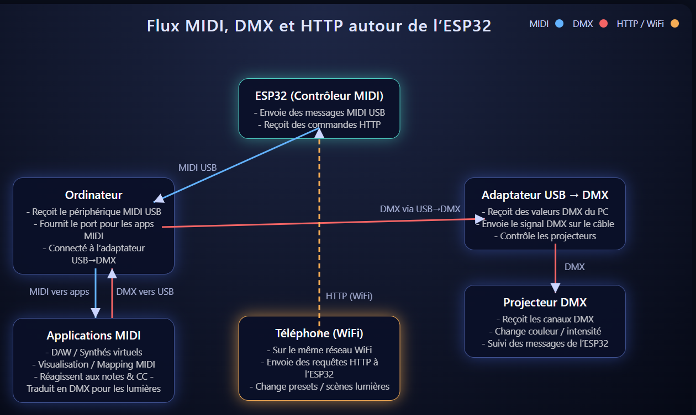
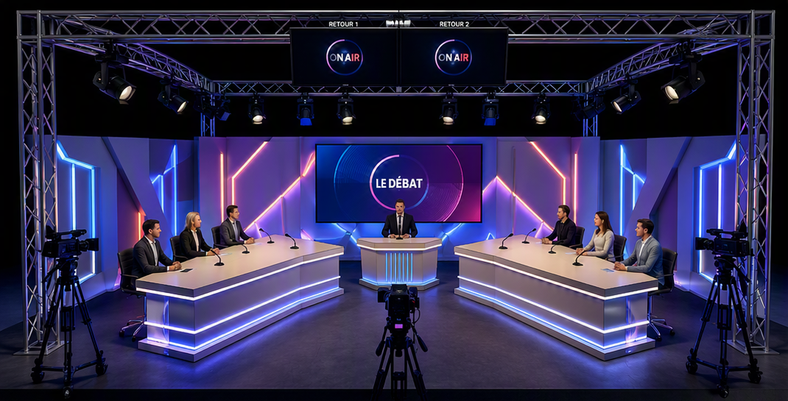

# 🎬 Automatisation des lumières, caméras et scènes via ESP32, DMX, OBS et Home Assistant

Ce projet a pour objectif de créer un studio vidéo automatisé, capable de changer lumières, caméras et scènes OBS en fonction d’objets connectés sur le réseau Wi‑Fi (smartphone, tablette, Home Assistant, etc.).
L’idée est de proposer une solution évolutive, open‑source et low‑cost (moins de 20 €) pour la partie contrôle, adaptée à des studios de débat, quiz, jeux télévisés, ou setups de streaming.

# 📺 Vidéo

Lien Youtube: [https://www.youtube.com/watch?v=GV8tmg4VnaE](https://www.youtube.com/watch?v=GV8tmg4VnaE)

# 🧩 Objectif

Rendre l’automatisation de studio simple, abordable et ouverte à tous. Que vous soyez créateur de contenu, streamer, technicien lumière, passionné de DIY ou utilisateur Home Assistant, ce projet vous permettra de créer un studio intelligent sans matériel coûteux.

Cette série de tutoriels a pour but de créer un contrôleur midi avec une interface web afin de pouvoir envoyer piloter des applications supportant le midi de n'importe quel appareil connecté sur le même reseau Wifi que le contrôleur.

# 🧠 Sujets qui seront abordé

 * Utilisation du protocole DMX pour contrôler des lumières de scènes
 * Utilisation du logiciel QLC+ pour contrôler des lumières de scènes
 * Utilisation du logiciel OBS Studio pour contrôler des scènes de streaming
 * Utilisation du protocole MIDI pour lancer des scènes sur OBS Studio et QLC+
 * Débuter dans la progammation d'ESP32 avec Arduino et/ou ESP-IDF
 * Création d'un contrôleur MIDI USB avec un ESP32
 * Création d'un Serveur Web avec un ESP32
 * Appeler les services (API) depuis Home Assistant

# 🚀 Architecture du projet

Le système repose sur une communication entre :
 * ESP32‑S3 → contrôle DMX et MIDI
 * QLC+ → gestion des lumières
 * OBS Studio → gestion des scènes vidéo
 * Home Assistant → déclenchement d’actions via API
 * Appareils connectés → interaction utilisateur (smartphone, tablette, etc.)

# 📦 Matériel nécessaire

 * ESP32‑S3 de type MK1 avec USB‑C
 
    
 * Câble USB‑C
 * Ordinateur avec QLC+ et OBS Studio
 * Connexion Wi‑Fi locale
Optionnels:
 * Projecteur(s) DMX
 * Adaptateur USB-DMX et son câble
 * Câble(s) DMX
 * Caméra(s)
 * Installation fonctionnelle de Home Assistant

# 🎬 Exemple de mise en scène

