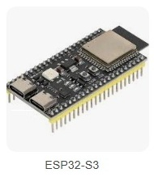
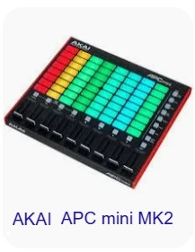

# 🎛️ Contrôler les scènes OBS Studio avec un contrôleur MIDI DIY sur ESP32‑S3

Ce guide explique comment contrôler les scènes OBS Studio avec un contrôleur MIDI.

# 🎯 Objectif du tutoriel

Permettre de contrôler les scènes d’OBS Studio à l’aide :
* d’un contrôleur MIDI DIY basé sur ESP32‑S3,
* et d’un Akai Professional APC Mini MK2,

en utilisant le protocole MIDI USB et le plugin OBS MIDI MG.

À la fin du tutoriel, tu pourras :
* Changer de scène dans OBS
* lancer des transitions,
* contrôler l’audio,
* déclencher l’enregistrement/streaming,
* utiliser les pads du APC Mini MK2 comme un Stream Deck lumineux,
* utiliser ton ESP32‑S3 comme un contrôleur MIDI personnalisé.

# 📺 Vidéo

Lien Youtube: [https://www.youtube.com/@Baronnix/playlists](https://www.youtube.com/@Baronnix/playlists)


# 🎛️ Présentation des deux contrôleurs

## 🟦 1. ESP32‑S3 — Contrôleur MIDI DIY



* USB MIDI natif via TinyUSB
* Boutons, encodeurs, LEDs totalement personnalisables
* Interface Graphique Web embarquée, personnalisable et accessible depuis n'importe quel appareil connecté sur le même réseau WIFI 
* Messages MIDI simples (NoteOn/NoteOff, Control Change)
* Idéal pour :
    * actions simples,
    * boutons dédiés,
    * encodeurs pour transitions/volume,
    * projets DIY évolutifs.

Tutoriels consacrés à sa fabrication: [https://github.com/Baronnix/ESP32/tree/main/Controleur%20Midi](https://github.com/Baronnix/ESP32/tree/main/Controleur%20Midi)

## 🟩 2. Akai Professional APC Mini MK2



* 64 pads RGB (8×8)
* 9 faders
* Boutons de fonctions
* LEDs RGB adressables
* Idéal pour :
    * contrôle visuel des scènes,
    * macros,
    * volumes audio,
    * workflow type Stream Deck avancé.

## ⚖️ Comparaison des deux contrôleurs

| Critère | ESP32‑S3 DIY | Akai APC Mini MK2
|--------------------------|-------------------------------------|-------------------------|
| Personnalisation | ⭐⭐⭐⭐⭐ totale | ⭐⭐ limitée |
| Nombre de boutons | variable | ⭐⭐⭐⭐⭐ (64 pads) |
| Faders | selon design | ⭐⭐⭐⭐⭐ (9 faders) |
| LED feedback | nécessite Websocket | ⭐⭐⭐⭐⭐ natif RGB |
| Complexité | ⭐⭐⭐⭐ avancée | ⭐⭐ simple |
| Idéal pour | projets DIY, encodeurs | contrôle visuel, scènes |

## 👉 Conclusion :

L’ESP32‑S3 est parfait pour un contrôleur sur mesure.

L’APC Mini MK2 est parfait pour un contrôleur de scènes avec retour LED.

# 🔌 Comparaison des solutions : Plugin vs Websocket

## 🟦 1. OBS MIDI MG (plugin)

* Simple, rapide, stable
* Détection automatique des contrôleurs MIDI
* Permet :
    * changement de scène,
    * transitions,
    * volumes,
    * macros OBS
* Ne permet pas le retour d’état LED
* Idéal pour :
    * ESP32‑S3
    * APC Mini MK2 (usage simple)

## 🟩 2. OBS Websocket

* Communication bidirectionnelle
* Permet :
    * retour d’état (scène active, mute, enregistrement…)
    * LEDs dynamiques sur APC Mini MK2
    * automatisation avancée
* Demande un script Python ou un microcontrôleur passerelle
* Idéal pour :
    * APC Mini MK2 (LED feedback)
    * ESP32‑S3 si tu veux un retour d’état

## 👉 Conclusion :

* ESP32‑S3 → OBS MIDI MG suffit largement
* APC Mini MK2 → OBS MIDI MG pour contrôle simple, Websocket pour LEDs

Dans ce tutoriel nous ne couvrirons pas la partie Websocket et nous nous focaliserons sur OBS MIDI MG.

# 🛠️ Configuration — Contrôle simple sans retour d’état (OBS MIDI MG)

Le moyen le plus simple pour contrôler OBS avec un contrôleur MIDI est d’installer le plugin OBS MIDI MG, qui permet d’assigner n’importe quel bouton/fader MIDI à une action OBS (changer de scène, lancer l’enregistrement, mute audio, etc.).
Ce plugin est gratuit et fonctionne sous Windows, macOS et Linux.

## 📥 1. Installer le plugin OBS MIDI MG

Tu dois installer le plugin obs-midi-mg (OBS MIDI MG).

Ce plugin ajoute une interface MIDI directement dans OBS.

1. Télécharge le plugin 
    * depuis la page officielle OBS Resources [https://obsproject.com/forum/resources/obs-midi-mg.1570/](https://obsproject.com/forum/resources/obs-midi-mg.1570/)
    * ou depuis GitHub [https://github.com/nhielost/obs-midi-mg/](https://github.com/nhielost/obs-midi-mg/)
2. Décompresse le dossier dans : C:\Program Files\obs-studio\obs-plugins
3. Redémarre OBS pour activer le plugin.


## 🎹 2. Connecter ton contrôleur MIDI

Branche ton contrôleur MIDI en USB.

Allume-le avant de lancer OBS (important pour la détection).

## 🧭 3. Activer le contrôleur dans OBS

1. Dans OBS va dans : Outils → OBS MIDI MG
2. Dans la fenêtre du plugin, va dans l’onglet MIDI Devices
3. Coche ton/tes contrôleur MIDI dans la liste. Active-le/les comme Input Device:
    * coche ESP32‑S3 MIDI
    * coche APC Mini MK2


## 🎛️ 4. Mapper les boutons du ESP32‑S3

1. Dans OBS va dans : Outils → OBS MIDI MG
2. Dans la fenêtre du plugin, va dans l’onglet Binding Collection
3. Renomme la collection en ESP32S3 Binding
4. Edite la collection
5. On va créer plusieurs actions de transition de scènes sur appui d'un bouton, pour chaque acion suit les étapes suivantes    
    1. 🧩 Étape 1 : Ajouter un binding
        1. Crée une action et nomme la
        2. Edite le message du binding
        3. Passe en mode écoute
        4. Appui sur le bouton à associer de ton contrôleur
        5. Confirme
    2. 🧩 Étape 2 : Assigner l’action
        1. Edite l'action à éxecuter
        2. Rentre les informations suivantes
            * Category: Scenes
            * Actin: Switch Scene
            * Scène: choisit la scène à afficher
        3. Confirme
6. Confirmer

## 🎛️ 5. Mapper les pad du APC Mini MK2

Suivre les mêmes étapes qui précédemment.

## 🧪 6. Tester

Retourne dans l'écran principal d'OBS Studio et appuie sur tes boutons MIDI → OBS doit changer de scène instantanément.

👉 À ce stade, les deux contrôleurs pilotent OBS, mais sans retour LED.

 
## 🎯  7. Conclusion

À ce stade, les deux contrôleurs pilotent OBS.

Les deux contrôleurs peuvent fonctionner ensemble sans conflit

Tu obtiens un setup professionnel, hybride, puissant

# 🛠️ Ajouter des fonctions avancées

## Contrôler aussi l’audio, l’enregistrement, etc.

Le plugin permet aussi :
* Régler le Volume (faders MIDI → volumes OBS)
* Mute/Unmute
* Démarrer/Arrêter l'enregistrement
* Activer la caméra virtuelle  

## Code Arduino et type de contrôle

### 🎹 Bouton → changer de scène

🧠 Le code du contrôleur correspondant à un appui de bouton est:
```cpp
// NoteOn canal 1, note 60, velocity 127
sendNoteOn(1, 60, 127);

// NoteOff
sendNoteOff(1, 60, 0);
```

### 🎚️ Encodeur → volume ou transition

🧠 Le code du contrôleur correspondant à un changement de volume via fader ou potentiomètre:

```cpp
// Control Change canal 1, CC 14, valeur 0–127
sendControlChange(1, 14, value);
```

# 🎯 Résultat

Avec ce tutoriel, ton ESP32‑S3 devient un Stream Deck MIDI capable de piloter OBS Studio :
* Changement de scènes
* Transitions
* Audio
* Enregistrement / streaming
* Contrôles avancés si tu ajoutes Websocket